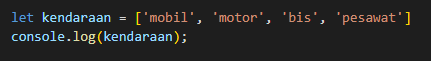
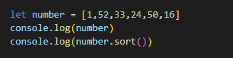
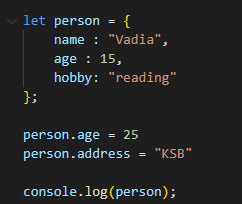
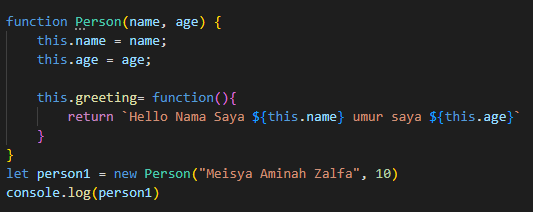

# JAVASCRIPT INTERMEDIETE

## Array
> Array adalah tipe data dengan variabel jamak yang dapat menyimpan berbagai macam tipe data di dalamnya.

**Mendefinisikan Array**

-  Array pada Javascript memiliki ciri khusus yaitu data yang ditampung dibungkus dengan sepasang kurung siku **[ ]** atau square brackets
 
   

   
**Memanggil Array**

- Setiap data di array memiliki nomor index. Nomor index berguna untuk mengakses data suatu array di posisi tertentu. Nomor index di array selalu dimulai dari angka nol 0.

- untuk memanggil array kita menggunakan perintah **console.log(nama variabel)**

   

   hasilnya console dapat dilihat di bawah ini

   

**Update Array**
- untuk mengupdate data array kita menggunakan nomor index nya

   
   *maka data dengan index 0 akan diganti menjadi **jet***

**Array Properties**
> Array memiliki 5 properti  yang sering digunakan :
- constuctor
- length
- index
- input
- prototype

- untuk mengetahui jumlah data pada array kita bisa menggunakan propreti *length* dengan menuliskan  **namaVariabel.length**

   

**Array Method**

Method | Deskripsi |
-----:|:-----:|
.push()| untuk menambahkan item array pada urutan paling terakhir|
.pop() | untuk menghapus item array pada index terakhir|
.shift() | untuk menghapus item array pada index pertama|
.unshift() | untuk menambahkan item array pada index pertama|
.sort() | untuk mengurutkan secara Ascending atau Descending Alphanumeric

contoh method *.sort()*

**Looping pada Array**
> Javascript sudah memiliki method untuk mempermudah programmer. Array memiliki built in method untuk melakukakn looping yaitu **.forEach()** dan **.map()**

Method | Deskripsi |
-----:|:-----:|
.forEach() | melakukan perulangan pada setiap element array|
.map() | melakukan perulangan dengan membuat array baru

## Object & Array of Object
### **Javascript Object**
> Object adalah sebuah tipe data yang memiliki properti dan fungsi(method)

*Note : properti (data y ang melekat pada sebuah object) dan fungsi/method(action dari sebuah object/ hal yang dapat dilakukan oleh object)*

**Mendefinisikan Object**
> Object sama seperti array yaitu dapat menyimpan properti dengan berbagai tipe data.

contohnya :

**Mengakses Object**
- untuk mengakses sebuah object bisa dengan cara seperti di bawah ini

   

- kita juga bisa menggunakan **bracket notation [ ]**  untuk memanggil properti sebuah objek

   

**Update Object**
> kita dapat melakukan update pada variabel dengan tipe data object

- Object dapat mengupdate value dari key yang sudah tersedia
- Object dapat menambahkan key dan value baru

Contohnya :

maka hasilnya :

*Note : tidak boleh mendefinisikan object dengan **const** karena kita tidak dapat mengupdate seluruh data object. Jika memiliki data yang harus di update, sebaiknya menggunakan fungsi **let** untuk mendeklarasikan variabel*

- Kita dapat menghapus properti dari object menggunakan **delete** operator

   

### **Array of Object**

> untuk data yang lebih dari satu, kita bisa menggunakan array of object

*note : jadi ada object di dalam array*

## Git & Github Lanjutan
>Dengan menggunakan GIT dan Github, kita bisa bekerja dalam sebuah tim. Tujuannya adalah kita bisa berkolaborasi mengerjakan proyek yang sama tanpa harus copy paste folder aplikasi yang terupdate. Kemudian kita bisa membuat file didalam projek yang sama atau membuat code di file yang sama dan menyatukannya saat sudah selesai.

* Repository adalah direktori proyek yang kita buat
* Repository GIT

*Note : untuk menghubungan git ke akun github menggunakan cara di bawah ini*

   

   *Cek apakah sudah terconnect atau belum dengan **git remote -v***

   

   *Jika sudah muncul tampilan seperti gambar di atas artinya akun github kita sudah terconnect*

 >Note : **Kondisi File pada GIT***
 
 > **modified** = kondisi dimana perubahan sudah dilakukan tapi belum ditandai (untracked)
    
> **staged** = kondisi dimana perubahan file sudah ditandai (modified), tapi belum di simpan di version control

> **commited** = perubahan sudah disimpan pada version control

   
   Command | Deskripsi |
   ----- | :------: |
   git init | untuk menginisialisasi git di folder/directory kerja kita|
   git status| untuk mengecek status dari git kita dan melihat adanya perubahan atau tidak yang dilakukan pada proyek tersebut, biasanya itu tentang file yang belum di add atau di commit|
   git add|  untuk mendaftarkan perubahan file pada suatu proyek ke staging area dan masih perlu di commit|
   git add . |untuk menambahkan seluruh file yang belum di add ke staging|
   git commit -m| "Pesan Commit" untuk menyimpan perubahan ke dalam version control|
   git log| untuk melihat history / kumpulan checkpoint(commit) yang telah kita buat|
   git log --oneline| untuk menampilkan history checkpoint satu baris saja|
   git revert| akan membatalkan semua perubahan yang ada tanpa menghapus commit terakhir|
   git reset| akan membatalkan semua perubahan yang ada dengan menghapus commit terakhir|
   git branch| untuk melihat kumpulan/list branch|
   git branch (nama branch yang di inginkan)| untuk membuat branch baru|
   git checkout (nama branch)| untuk pindah ke branch yang kita inginkan|
   git checkout -b (nama branch)| untuk membuat branch baru dan langsung pindah ke branch yang kita baru buat|
   git branch -d (nama branch)| untuk menghapus branch |
   git merge (nama target branch yang ingin kita tarik)| untuk menggabungkan kedua buah branch|
   git push -u origin main| untuk mengirim (upload) perubahan yang sudah kita buat di local ke remote repository kita|
   git clone| untuk menyalin/mengcopy proyek yang kita buat|
   git diff| untuk cek perubahan|
   git checkout HEAD~3 (nama file)| untuk mengembalikan commit jauh ke bawah. Misal kita ingin kembali pada 3 commit sebelumnya|

## Rekursif

> Rekursif adalah fungsi yang memanggil dirinya sendiri sampai kondisi tertentu. Jadi rekursif akan melakukan perulangan sebanyak pemanggilan fungsinya.

> Contoh Penulisan Struktur Rekursive

*note : kita mendefinisikan fungsi dimana di dalam fungsi terdapat fungsi lagi.*

*note :* 
- *di dalam rekursif ada kondisi, untuk memberikan batasan perulangan sampai mana*
- *rekursif akan berhenti memanggil dirinya sendiri jika kondisi terpenuhi*

Contoh :

hasilnya :

## Regex
> Regex adalah sebuah susunan karakter yang menggambarkan pattern/pola untuk pencarian text pada sebuah string atau document.

> Contoh kasus regex
- validasi input dari sebuah form (validasi input data) 
- pencarian data berdasarkan keyword pada email atau halaman website
- dan lainnya

> Literal yaitu konsep regex dimana kita membuat regex sesuai dengan text yang ingin kita cari/match atau mengandung teks yang kita cari

**Built and Method**
> ada beberapa built and method

Method | Deskripsi |
-----:|:-----:|
test() | mengembalikan nilai *true* or *false* untuk kecocokan sebuah teks yang dicari|
match() | mengembalikan nilai array dari karakter yang match|

contoh penulisan regex:

## OOP (Object Oriented Programming)

> OOP adalah suatu paradigma dalam pemograman. Dengan menggunakan OOP kita bisa menulis syntax menjadi lebih ringkas.

> OOP pada Javascript dibuat menggunakan **function** atau **class**

Contoh penulisan OOP

*Note : **this** merupakan keyword khusus yang merujuk pada object pemiliknya*

> 4 Pilar Dalam OOP
>- Encapsulation : adalah cara membatasi nilai data dari sebuah objek 
>- Abstraction : yaitu tehnik untuk menyembunyikan detail tertentu pada sebuah object
>- Inheritence : (konsep pewarisan) , yaitu sebuah proses dimana sebuah class mewariskan property dan method nya ke class lain/child nya.
>- Polymorpishm :yaitu konsep yang dikenal untuk membuat object menjadi banyak bentuk

## Modules

> modules adalah reusable code(data yang digunakan berulang kali) yang dapat di export dari suatu file javascript dan di import ke file javascript yang lain

> bagaimana cara kita menggunakan fungsi menjadi lebih mudah, yaitu memakai **Export** dan **Import**

> Type module didefinisikan di file HTML, yaitu di tulis pada tag `<script>`

## Web Storage
> Web Storage adalah sebuah wadah untuk menyimpan data yang terikat pada web browser.

**Jenis-Jenis Storage**
- Local Storage
- Session Storage
- Indexed DB
- Web SQL
- Cookies
- Trust Tokens
- Interest Groups

### **1. Local Storage**
> Local Storage adalah sebuah wadah/data yang akan selamanya disimpan. Jadi ketika kita keluar(close) dari browser, data di browser tidak akan dihapus.

> ada beberapa method pada local storage :
> - setItem = perintah untuk menyimpan token ke dalam local storage
> - getItem = perintah untuk mengambil value pada local storage
> - removeItem = perintah menghapus data dari local storage nya

### **2. Session Storage**
> adalah sebuah wadah/data yang tidak akan disimpan. Jadi data di browser akan terhapus ketika kita close browsernya.

> sama dengan local storage, pada session storage juga menggunakan method yang sama, yaitu ada getItem, setItem, removeItem dan lainnya.

## Asynchronous-Introduction

> -  Synchronous : mengeksekusi perintah satu per satu dan berurutan
> - Asynchronous : mengizinkan komputer kita untuk memproses perintah lain sambil menunggu suatu proses lain yang sedang berlangsung. Artinya kita bisa melakukan lebih dari 1 proses sekaligus (multi-thread).

> Asynchronous di Javascript (untuk mendapatkan data ke server)
> - Promise : pada promise akan dipisahkan menjadi 2, yaitu menggunakan **then** (ketika keadaan berhasil) dan **catch** (ketika keadaan gagal/error) 
> - Async/Await
> - Fetch : fetch data merupakan fungsi komunikasi HTTP yang bertujuan untuk mengambil dan mengirimkan data ke suatu server
